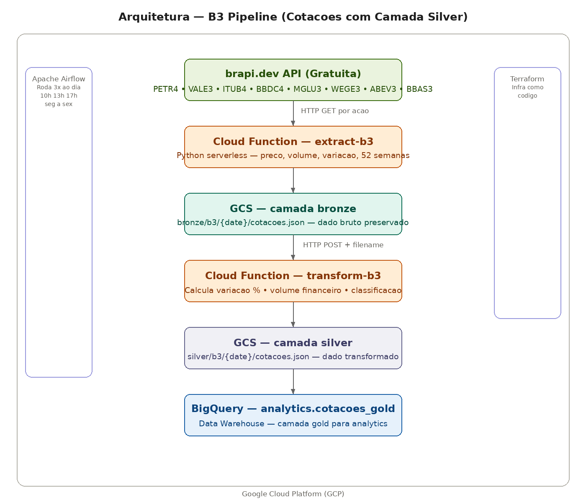

# B3 Pipeline — Cotações de Ações em Tempo Real com Camada Silver

Pipeline de dados que coleta cotações das principais ações da B3 três vezes ao dia, aplicando medallion architecture com camadas bronze, silver e gold — diferencial que mostra transformações reais além de simples movimentação de dados.

## Arquitetura



**Ingestão:** Cloud Function Python coleta cotações via brapi.dev — preço, volume, variação, máximas e mínimas de 52 semanas de 8 ações da B3.

**Bronze:** Dados brutos preservados no GCS exatamente como vieram da API — garantindo reprocessamento a qualquer momento sem nova chamada à fonte.

**Silver:** Segunda Cloud Function transforma os dados calculando variação percentual, volume financeiro (preço × volume), classificação da variação e métricas derivadas — salvando também no GCS antes de ir pro BigQuery.

**Gold:** Dados modelados e enriquecidos disponíveis no BigQuery para analytics e consultas SQL.

**Orquestração:** Airflow agenda o pipeline 3x ao dia (10h, 13h e 17h) de segunda a sexta — capturando abertura, meio do dia e fechamento do mercado.

## Ações monitoradas

| Ticker | Empresa |
|---|---|
| PETR4 | Petrobras |
| VALE3 | Vale |
| ITUB4 | Itaú Unibanco |
| BBDC4 | Bradesco |
| MGLU3 | Magazine Luiza |
| WEGE3 | WEG |
| ABEV3 | Ambev |
| BBAS3 | Banco do Brasil |

## Camada Silver — transformações aplicadas

- **Variação percentual** — calculada e classificada em: alta_forte, alta, estável, baixa, baixa_forte
- **Volume financeiro** — preço × volume, mostrando o capital movimentado
- **Métricas de 52 semanas** — distância da mínima e máxima anuais
- **Classificação automática** — cada ação recebe um label de performance do dia

## Tecnologias

| Tecnologia | Função |
|---|---|
| Python | Lógica das Cloud Functions |
| Google Cloud Functions | Execução serverless |
| Google Cloud Storage | Data Lake — bronze e silver |
| BigQuery | Data Warehouse — gold |
| Apache Airflow | Orquestração 3x ao dia |
| Terraform | Infraestrutura como código |

## Queries no BigQuery

```sql
-- Cotacoes do dia ordenadas por variacao
SELECT symbol, short_name, preco_atual, variacao_percent, classificacao, volume_financeiro
FROM `b3-pipeline-496319.analytics.cotacoes_gold`
ORDER BY variacao_percent DESC;

-- Maiores volumes financeiros do dia
SELECT symbol, preco_atual, volume, volume_financeiro
FROM `b3-pipeline-496319.analytics.cotacoes_gold`
ORDER BY volume_financeiro DESC;

-- Acoes perto da maxima de 52 semanas
SELECT symbol, preco_atual, maxima_52s,
  ROUND((preco_atual / maxima_52s) * 100, 1) as pct_da_maxima
FROM `b3-pipeline-496319.analytics.cotacoes_gold`
ORDER BY pct_da_maxima DESC;

-- Historico de variacao por acao
SELECT symbol, extraction_date, extraction_timestamp, variacao_percent, classificacao
FROM `b3-pipeline-496319.analytics.cotacoes_gold`
ORDER BY symbol, extraction_timestamp DESC;
```

## Como rodar

### 1. Criar infraestrutura GCP
```bash
cd terraform
terraform init
terraform apply
```

### 2. Deploy das Cloud Functions
```bash
gcloud functions deploy extract-b3 \
  --gen2 --runtime=python311 --region=us-central1 \
  --source=functions/extract --entry-point=extract_b3 \
  --trigger-http --allow-unauthenticated --timeout=120s

gcloud functions deploy transform-b3 \
  --gen2 --runtime=python311 --region=us-central1 \
  --source=functions/transform --entry-point=transform_b3 \
  --trigger-http --allow-unauthenticated --timeout=120s
```

### 3. Subir o Airflow
```bash
cd docker
docker compose up airflow-init
docker compose up -d
```

Acesse o Airflow em `http://localhost:8089` e ative a DAG `pipeline_b3`.

## Autor

**Lucas Magalhães** — Engenheiro de Dados

[](https://github.com/lucasmagalhaess)
[](https://linkedin.com/in/lucasmagalhaes-data)
